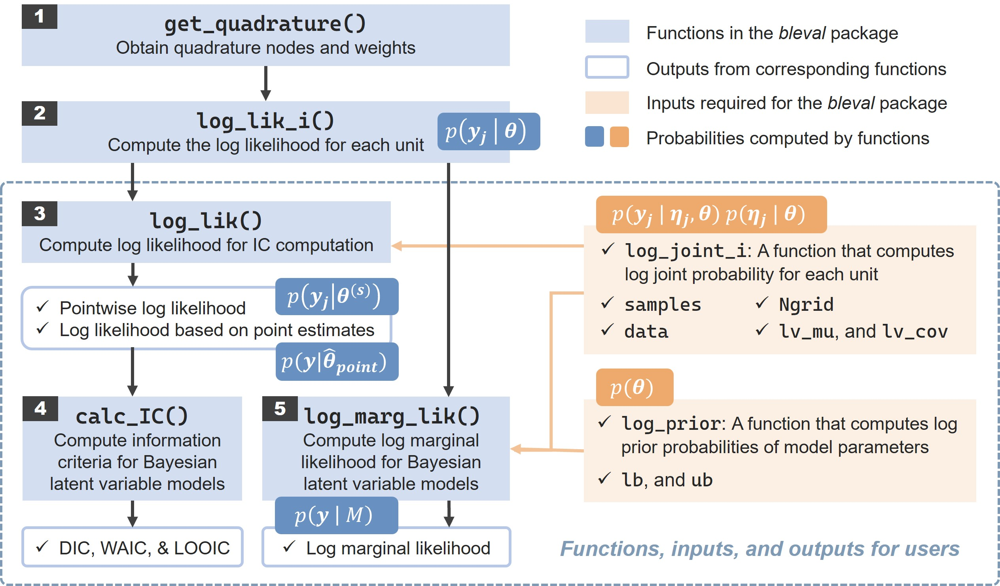

# bleval: Bayesian Evaluation for Latent Variable Models

## 📑 Table of Contents

-   [Overview](#-overview)
-   [Workflow](#-workflow)
-   [Citation](#-citation)
-   [Installation](#-installation)
-   [Model Examples Overview](#-model-examples-overview)
-   [Example: Evaluating a Gaussian Linear Mixed Model](#-example-evaluating-a-gaussian-linear-mixed-model)
    -   [Data Generation](#-1-data-generation)
    -   [Parameter Estimation in JAGS](#-2-parameter-estimation-in-jags)
    -   [Model Evaluation with bleval](#-3-model-evaluation-with-bleval)

------------------------------------------------------------------------

## 🔍 Overview

The `bleval` package provides tools for evaluating Bayesian latent variable models, such as structural equation models (SEMs), item response theory (IRT) models, and multilevel models (MLMs).

It uses **adaptive Gauss-Hermite quadrature** to approximate marginal likelihoods by integrating out latent variables, supporting the computation of widely used Bayesian evaluation criteria, including:

-   **Deviance Information Criterion (DIC)**
-   **Watanabe-Akaike Information Criterion (WAIC)**
-   **Leave-One-Out Information Criterion (LOOIC)**
-   **Fully marginal likelihoods** for Bayes factor computation

The package is particularly useful for researchers aiming to generalize their findings beyond observed units, as it emphasizes the importance of integrating out latent variables for predictive accuracy.

With step-by-step guidance, bleval facilitates the practical implementation of Bayesian model evaluation, making it accessible for applied researchers in psychology and related fields.

------------------------------------------------------------------------

## 🧊️ Workflow

The workflow of the `bleval` package is illustrated in the figure below:



*Notes*: The first two functions, located outside the dashed box, are used internally within the package to compute the marginal likelihood integrating out latent variables for each unit. The other three functions, highlighted within the dashed box, are user-facing functions designed for computing model evaluation measures.

1.  **Generate quadrature nodes and weights**: The `get_quadrature` function generates quadrature nodes and weights for numerical integration.
2.  **Compute log marginal likelihood**: The `log_marglik_i` function computes the log marginal likelihood for each unit by integrating out latent variables using adaptive Gauss-Hermite quadrature.
3.  **Compute information criteria**: The `log_marglik` function computes the log marginal likelihood for all units, and the `calc_IC` function calculates DIC, WAIC, and LOOIC.
4.  **Compute fully marginal likelihood**: The `log_fmarglik` function computes the log fully marginal likelihood by integrating out both latent variables and model parameters using bridge sampling.

------------------------------------------------------------------------

## 📘 Citation

If you use the `bleval` package in your research, please cite it as follows:

Luo, X., Dong, J., Liu, H., & Liu, Y. (in preparation). Bayesian Model Evaluation for Latent Variable Models: A Tutorial on Computing Information Criteria and Bayes Factors with the R Package *bleval*. *Journal*, *XX*(X), XXX-XXX.\
DOI: [...]

------------------------------------------------------------------------

## 🌐 Installation

You can install the `bleval` package directly from GitHub using the `devtools` package:

``` r
# Install devtools if you haven't already
install.packages("devtools")

# Install bleval from GitHub
devtools::install_github("luoxh3/bleval")
```

------------------------------------------------------------------------

## 📁 Model Examples Overview

The `bleval` package provides **a flexible framework** for Bayesian evaluation of various latent variable models. While the package can be adapted to many model types, we demonstrate its application through several representative examples across three main categories: Structural Equation Models (SEM), Multilevel Models (MLM), and Item Response Theory (IRT) models. The table below summarizes these illustrative examples with their key characteristics.

| Model Category and Specification | Number of Latent Variables | Marginal Likelihood Tractability | Vignette File Name |
|------------------|------------------|-------------------|------------------|
| SEM: Confirmatory Factor Analysis (CFA) | 1 | Yes | `SEM_CFA.R` |
| SEM: Latent Variable Mediation | 3 | Yes | `SEM_mediation.R` |
| SEM: Latent Variable Moderation (with product terms) | 3 | No | `SEM_moderation.Rmd` |
| MLM: Gaussian Linear Mixed Model (random intercept + slope) | 2 | Yes | `MLM_linear_mixed.Rmd` |
| MLM: Location-Scale Model (random effects for both mean and variance) | 4 | No | `MLM_location_scale.R` |
| IRT: Unidimensional 2PL (binary responses) | 1 | No | `IRT_2PL.R` |
| IRT: Unidimensional GPCM (ordinal responses) | 1 | No | `IRT_GPCM.R` |
| IRT: Unidimensional GRM (ordinal responses) | 1 | No | `IRT_GRM.R` |
| IRT: Multidimensional GPCM (5 dimensions) | 5 | No | `IRT_MGPCM.Rmd` |
| IRT: Mixture Rasch Model | 2 | No | `IRT_mixture_Rasch.Rmd` |

Each vignette provides a complete workflow for model evaluation using the `bleval` package. Note that while some examples include data generation steps using simulated data, others begin with parameter estimation using empirical datasets. All examples demonstrate the full model evaluation pipeline including computation of information criteria (DIC, WAIC, LOOIC) and fully marginal likelihoods.

------------------------------------------------------------------------

## 📋 Example: Evaluating a Gaussian Linear Mixed Model

This guide demonstrates how to use the `bleval` package to evaluate a Bayesian Gaussian linear mixed model with a random intercept and a random slope. The example is based on a simulated dataset.

Note: For more detailed examples of using the `bleval` package with **multilevel models (MLM)**, **structural equation models (SEM)**, and **item response theory (IRT) models** (based on both simulated and empirical data), please refer to the vignette files listed in the [Model Examples Overview](#-model-examples-overview) section.

## 🎯 1 Data Generation

We generate a dataset from a Gaussian linear mixed model with 500 level-2 units and 50 level-1 units per level-2 unit.

``` r
library(MASS)
library(dplyr)

set.seed(123)
Nnum <- 500  # Number of level-2 units
Tnum <- 50   # Number of level-1 units
beta <- c(0, 0.3) # Fixed effects
rho <- 0.3   # Correlation between random intercept and slope
u_cov <- sqrt(1) * sqrt(0.09) * rho
u_sigma <- matrix(c(1, u_cov, u_cov, 0.09), nrow = 2)

bdata <- as.data.frame(mvrnorm(Nnum, mu = beta, Sigma = u_sigma))
names(bdata) <- c("mu_i", "phi_i")
bdata$ID <- c(1:Nnum)

mydata <- data.frame(matrix(NA, nrow = Nnum*Tnum, ncol = 2))
names(mydata) <- c("ID", "t")
mydata$ID <- rep(1:Nnum, each = Tnum)
mydata$t <- rep(1:Tnum, Nnum)

mydata$e_it <- rnorm(n = Nnum*Tnum, mean = 0, sd = 0.1)
mydata$x_it <- rnorm(n = Nnum*Tnum, mean = 0, sd = 1)

mydata <- left_join(mydata, bdata[, c("ID", "phi_i","mu_i")], by = "ID")
mydata$y_it <- mydata$mu_i + mydata$x_it*mydata$phi_i + mydata$e_it
```

## 🎯 2 Parameter Estimation in JAGS

We define the data-generating Bayesian model in JAGS and estimate parameters using MCMC sampling.

``` r
library(rjags)

model_string <- "
  model {
    # likelihood ------------------------------
    for (j in 1:Nobs) {
      y[j] ~ dnorm(y_mu[j], y_pre)
      y_mu[j] <- mu[subject[j]] + phi[subject[j]] * x[j]
    }
    for (i in 1:N) {
      mu[i]  <- raneff[i,1]
      phi[i] <- raneff[i,2]
      raneff[i,1:2] ~ dmnorm(beta[1:2], pre[1:2,1:2])
    }
    # priors ---------------------------------
    y_pre ~ dgamma(0.001, 0.001)
    beta[1] ~ dnorm(0, 0.01)
    beta[2] ~ dnorm(0, 0.01)
    beta_0 <- beta[1]
    beta_1 <- beta[2]
    tau_beta_0 ~ dgamma(0.001, 0.001)
    sd_beta_0 <- sqrt(1/tau_beta_0)
    tau_beta_1 ~ dgamma(0.001, 0.001)
    sd_beta_1 <- sqrt(1/tau_beta_1)
    rho ~ dunif(-1, 1)
    sigma[1,1] <- sd_beta_0 * sd_beta_0
    sigma[2,2] <- sd_beta_1 * sd_beta_1
    sigma[1,2] <- sd_beta_0 * rho * sd_beta_1
    sigma[2,1] <- sigma[1,2]
    pre[1:2,1:2] <- inverse(sigma[1:2,1:2])
  }
"

data_list <- list(
  Nobs = nrow(mydata),
  subject = mydata$ID,
  N = length(unique(mydata$ID)),
  y = mydata$y_it,
  x = mydata$x_it
)

# Initialize the JAGS model
jags_model <- jags.model(textConnection(model_string), data = data_list, n.chains = 4)
# Run the MCMC sampler with a burn-in period of 5000 iterations
update(jags_model, 5000)
# Draw posterior samples from the model
variables <- c("mu", "phi", 
               "beta_0", "beta_1", "y_pre", "tau_beta_0", "tau_beta_1", "rho")
post <- coda.samples(jags_model, variable.names = variables, n.iter = 25000, thin = 10)

# Combine posterior samples from all chains into a single matrix
samps <- do.call(rbind, post)
dim(samps)
# Extract posterior samples for model parameters only (excluding latent variables)
pars_vector <- c("beta_0", "beta_1", "y_pre", "tau_beta_0", "tau_beta_1", "rho")
samps2 <- as.matrix(samps[ ,pars_vector])
dim(samps2)
```

## 🎯 3 Model Evaluation with `bleval`

We now evaluate the model using the `bleval` package step by step.

Note: The `bleval` package provides a powerful and flexible framework for Bayesian evaluation of latent variable models. While specifying the custom functions requires care, this approach gives you full control over the model evaluation process and ensures that latent variables are properly accounted for in your model comparisons.

## 🎯 3.1 Compute Information Criteria

### 1️⃣ Step 1: Specify the `log_joint_i` function

The `log_joint_i` function calculates the log joint density for each unit. This function takes the following inputs:

-   `samples_s`: A named vector of parameter values from a posterior sample.
-   `data`: A list containing the observed data.
-   `i`: The index of the unit.
-   `Ngrid`: The number of quadrature nodes per latent variable.
-   `nodes`: A matrix of latent variable values transformed from the quadrature nodes (output of the `get_quadrature` function).

#### 💡 Tips for Writing `log_joint_i`

-   **Understanding the components**:
    -   Conditional likelihood p(y_j \| η_j, θ): the probability of observed data for unit j given latent variables and parameters
    -   Latent variable density p(η_j \| θ): the density of latent variables
    -   The function should return: log p(y_j \| η_j, θ) + log p(η_j \| θ)
-   **Use the "\~" Heuristic**: Inspect your JAGS model and identify all lines with "\~" symbols. The log of the densities on the right-hand side of these "\~" symbols needs to be evaluated and summed. For `log_joint_i`, focus on the lines corresponding to:
    -   Observations given latent variables (conditional likelihood): `y ~ distribution(...)`
    -   Latent variables given parameters: `latent_variable ~ distribution(...)`
-   **Map to Model Specification**: Write down your model mathematically first, then translate each component to code
-   **Check Dimensions**: Ensure all matrices and vectors have compatible dimensions
-   **Use Log-Scale**: Always work on log-scale for numerical stability

```{r}
log_joint_i <- function(samples_s, data, i, Ngrid, nodes) {
  # ==================================================
  # STEP 1: Extract data for the current unit i
  # ==================================================
  # In MLM context: i represents a level-2 unit (e.g., school, person)
  Nobs <- data$Nobs    # Total number of observations
  Nnum <- data$N       # Number of level-2 units
  Tnum <- Nobs / Nnum  # Number of the observations per unit
  
  # Extract observations for unit i
  y_i <- data$y[((i-1)*Tnum+1):(i*Tnum)]  # Outcome values for unit i
  x_i <- data$x[((i-1)*Tnum+1):(i*Tnum)]  # Predictor values for unit i
  
  # ==================================================
  # STEP 2: Prepare data structures for quadrature
  # ==================================================
  # The 'nodes' matrix contains quadrature points for latent variables
  # Each row represents one combination of latent variable values
  # For 2 latent variables with Ngrid = 9: nodes has 81 rows, 2 columns
  
  # This data expansion enables efficient matrix-based computation,
  # avoiding explicit loops and improving computational performance in STEP 3.

  # Expand x and y to match the quadrature grid dimensions
  x_i_extended_mat <- matrix(rep(x_i, times = Ngrid * Ngrid), 
                             nrow = Ngrid * Ngrid, byrow = TRUE)
  y_i_extended_mat <- matrix(rep(y_i, times = Ngrid * Ngrid), 
                             nrow = Ngrid * Ngrid, byrow = TRUE)
  
  # ==================================================
  # STEP 3: Compute log conditional likelihood
  # ==================================================
  # This corresponds to: log p(y_j | η_j, θ)
  # In this Gaussian linear mixed model: y_it ~ N(μ_i + φ_i * x_it, σ²)
  
  # Compute predicted values for each quadrature point
  # nodes[,1] = random intercept values, nodes[,2] = random slope values
  predicted_y <- nodes[, 1] + nodes[, 2] * x_i_extended_mat
  
  # Compute log-density for each observation at each quadrature point
  log_con_t_i <- dnorm(y_i_extended_mat, mean = predicted_y, 
                       sd = 1 / sqrt(samples_s[["y_pre"]]), log = TRUE)
  
  # Sum over observations within the unit (conditional independence)
  log_con_i <- rowSums(log_con_t_i)
  
  # ==================================================
  # STEP 4: Compute log density for latent variables
  # ==================================================
  # This corresponds to: log p(η_j | θ)
  # In this Gaussian linear mixed model: random effects ~ MVN(β, G)
  
  # Extract parameters for the random effects distribution
  sd_mu <- sqrt(1 / samples_s[["tau_beta_0"]])   # SD for random intercept
  sd_phi <- sqrt(1 / samples_s[["tau_beta_1"]])  # SD for random slope
  mean <- c(samples_s[["beta_0"]], samples_s[["beta_1"]])  # Fixed effects
  
  # Construct covariance matrix for random effects
  sigma <- matrix(c(sd_mu^2, sd_mu * samples_s[["rho"]] * sd_phi,
                    sd_mu * samples_s[["rho"]] * sd_phi, sd_phi^2), nrow = 2)
  
  # Compute multivariate normal log-density for random effects
  log_raneff_i <- mvtnorm::dmvnorm(nodes, mean, sigma, log = TRUE)
  
  # ==================================================
  # STEP 5: Return the log joint density for each unit
  # ==================================================
  # This equals: log p(y_j | η_j, θ) + log p(η_j | θ)
  log_con_i + log_raneff_i
}
```

### 2️⃣ Step 2: Compute the posterior means and covariance matrices of latent variables

These values are used to adapt the quadrature nodes and weights in the adaptive Gauss-Hermite quadrature.

```{r}
# Create lists to store posterior means and covariance matrices of random effects
raneff_mu_list <- vector("list", Nnum)
raneff_cov_list <- vector("list", Nnum)

for (i in 1:Nnum) {
  # Compute the posterior mean of the random intercept and slope for unit i
  raneff_mu_list[[i]] <- c(
    mean(samps[, paste0("mu[", i, "]")]),
    mean(samps[, paste0("phi[", i, "]")]))
  # Compute the posterior covariance matrix of the random intercept and slope for unit i
  raneff_cov_list[[i]] <- cov(samps[, c(paste0("mu[", i, "]"), 
                                        paste0("phi[", i, "]"))])
}
```

### 3️⃣ Step 3: Compute the log marginal likelihood

The `log_marglik` function from the `bleval` package computes the log marginal likelihood by integrating out the latent variables using adaptive Gauss-Hermite quadrature. This function requires the following inputs:

-   `samples`: A matrix or data frame containing the posterior samples of model parameters.
-   `data`: A list of data, including an element 'N' which indicates the number of units
-   `Ngrid`: The number of quadrature nodes for each latent variable.
-   `lv_mu`: A list of posterior means of the latent variables.
-   `lv_cov`: A list of posterior covariance matrices of the latent variables.
-   `log_joint_i`: A user-defined function to compute the log joint density for each unit.

```{r}
log_marglik_result <- bleval::log_marglik(samples = samps2, data = data_list, Ngrid = 9,
                                          lv_mu = raneff_mu_list, lv_cov = raneff_cov_list,
                                          log_joint_i = log_joint_i)
```

The output of this function is a list containing two objects:

-   log_marglik_point: A matrix of log marginal likelihoods for each data point.
-   log_marglik_postmean: A vector of log marginal likelihoods computed using the point estimates (posterior means) of the model parameters.

### 4️⃣ Step 4: Compute information criteria

The `calc_IC` function from the `bleval` package computes the information criteria (DIC, WAIC, and LOOIC) based on the log marginal likelihoods obtained from the `log_marglik` function. This function requires the following inputs:

-   `log_marglik_result`: The output from the `log_marglik` function.
-   `type`: An integer indicating the version of the effective number of parameters (p_D) to use for the DIC calculation. Version 1 is based on the mean of log marginal likelihood values (default), and Version 2 is based on the variance of log marginal likelihood values.

```{r}
bleval::calc_IC(log_marglik_result, 1)
```

The output of this function includes the following information criteria:

-   DIC: Deviance Information Criterion
-   WAIC: Watanabe-Akaike Information Criterion
-   LOOIC: Leave-One-Out Information Criterion

## 🎯 3.2 Compute Fully Marginal Likelihood

### 1️⃣ Step 1: Specify the `log_prior` function

The `log_prior` function calculates the log prior density for model parameters. This function takes a named vector of parameter values from a posterior sample and returns the log prior density for each parameter. The priors used in this example include:

-   Gamma priors for the precision parameters.
-   Normal priors for the fixed effects.
-   A uniform prior for the correlation parameter.

#### 💡 Tips for Writing `log_prior`

-   **One-to-One Translation**: Each prior in your JAGS/Stan model becomes one line in this function
-   **Use the "\~" Heuristic**: Inspect your JAGS model and identify all lines with "\~" symbols. The log of the densities on the right-hand side of these "\~" symbols needs to be evaluated and summed. For `log_prior`, focus on the lines like:
    -   `parameter ~ prior_distribution(...)`
-   **Use Log-Scale**: Remember to use log = TRUE in all density functions

```{r}
log_prior <- function(samples_s) {
  # ==================================================
  # Translate JAGS priors to R density functions:
  # 
  # JAGS: y_pre ~ dgamma(0.001, 0.001)
  # R:    dgamma(y_pre, shape = 0.001, rate = 0.001, log = TRUE)
  #
  # JAGS: beta_0 ~ dnorm(0, 0.01)
  # R:    dnorm(beta_0, mean = 0, sd = sqrt(1/0.01), log = TRUE)
  #
  # JAGS: rho ~ dunif(-1, 1)
  # R:    dunif(rho, min = -1, max = 1, log = TRUE)
  # ==================================================
  
  # Sum all log-prior densities (independent priors)
  dgamma(samples_s[["y_pre"]], shape = 0.001, rate = 0.001, log = TRUE) +
  dnorm(samples_s[["beta_0"]], mean = 0, sd = sqrt(1/0.01), log = TRUE) +
  dnorm(samples_s[["beta_1"]], mean = 0, sd = sqrt(1/0.01), log = TRUE) +
  dgamma(samples_s[["tau_beta_0"]], shape = 0.001, rate = 0.001, log = TRUE) +
  dgamma(samples_s[["tau_beta_1"]], shape = 0.001, rate = 0.001, log = TRUE) +
  dunif(samples_s[["rho"]], min = -1, max = 1, log = TRUE)
}
```

### 2️⃣ Step 2: Define parameter bounds

The `log_fmarglik` function requires lower and upper bounds for the model parameters. These bounds ensure that the parameter values remain within their valid ranges during the computation of the fully marginal likelihood.

```{r}
# Define bounds based on parameter constraints:
# - beta_0, beta_1: unbounded (-Inf to Inf)
# - y_pre, tau_beta_0, tau_beta_1: precision parameters, must be positive (0 to Inf)
# - rho: correlation, bounded between -1 and 1

lb <- c(rep(-Inf, 2), rep(0, 3), -1)
ub <- c(rep(Inf, 2), rep(Inf, 3), 1)
names(lb) <- pars_vector
names(ub) <- pars_vector # c("beta_0", "beta_1", "y_pre", "tau_beta_0", "tau_beta_1", "rho")
```

### 3️⃣ Step 3: Compute the log fully marginal likelihood

The `log_fmarglik` function from the `bleval` package computes the log fully marginal likelihood by integrating out both the latent variables and the model parameters. This function requires the following inputs:

-   `samples`: A matrix or data frame containing the posterior samples of model parameters.
-   `data`: A list of data, including an element 'N' which indicates the number of units
-   `Ngrid`: The number of quadrature nodes for each latent variable.
-   `lv_mu`: A list of posterior means of the latent variables.
-   `lv_cov`: A list of posterior covariance matrices of the latent variables.
-   `log_joint_i`: A user-defined function to compute the log joint density for each unit.
-   `log_prior`: A user-defined function to compute the log prior density for model parameters.
-   `lb`: A named vector of lower bounds for the model parameters.
-   `ub`: A named vector of upper bounds for the model parameters.

```{r}
bleval::log_fmarglik(samples = samps2, data = data_list, Ngrid = 9,
                     lv_mu = raneff_mu_list, lv_cov = raneff_cov_list,
                     log_joint_i = log_joint_i, log_prior = log_prior,
                     lb = lb, ub = ub)
```

The output of this function is the log fully marginal likelihood, which can be used to compute Bayes factors for model comparison.

#### 💡 Tips for Verifying Your Custom Functions

Specifying the `log_joint_i` and `log_prior` functions correctly is crucial. Here are some strategies to help you verify your implementation:

-   **Heuristic Check ("\~" Symbol)**: Inspect your JAGS/Stan model code. Every line with a "\~" symbol corresponds to a log-density that should be included in your custom functions.

    -   Lines for observed variables and latent variables go into `log_joint_i`.

    -   Lines for model parameters go into `log_prior`.

-   **Parameterization Check**: Different software uses different parameterizations for distributions. For example, JAGS's dnorm uses mean and precision, while R's dnorm uses mean and standard deviation. Ensure your R functions use the correct parameters (e.g., sd = sqrt(1/precision)).

-   **Test with a Single Sample**: Before running the full `bleval` analysis, test your `log_joint_i` and `log_prior` functions with a single set of parameter values from your posterior samples (samples_s) and a single unit (i). Check that the function runs without errors and returns a finite value.

-   **Check the Effective Number of Parameters**: After computing the information criteria, look at the effective number of parameters (p_dic, p_waic, p_loo). While not exactly equal, this value should be a reasonable reflection of your model's complexity (i.e., the number of actual model parameters, not including latent variables). A value that is drastically different (e.g., orders of magnitude too large or small) may indicate a problem in your likelihood specification.
